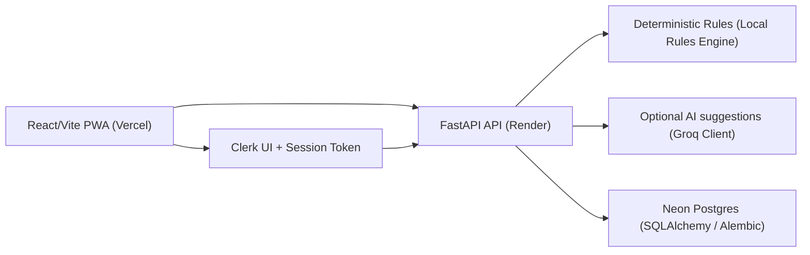
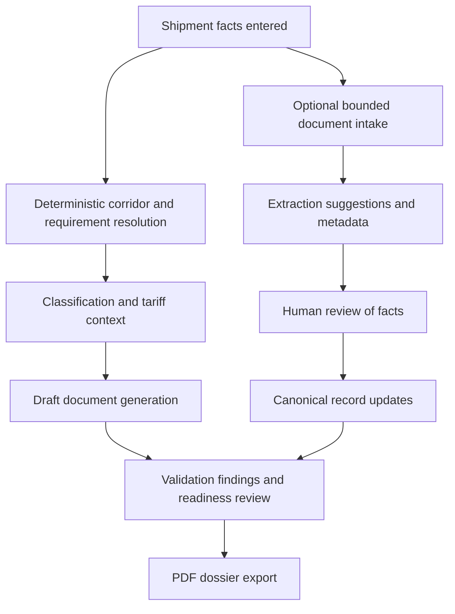

# FreightDoc

FreightDoc prepares review-ready export-documentation dossiers from shipment facts. It is preparation software designed to streamline compliance, document checking, and validation workflows.

---

## Table of Contents

- [What FreightDoc Is](#what-freightdoc-is)
- [Why It Exists](#why-it-exists)
- [What the Product Does Today](#what-the-product-does-today)
- [What It Does Not Do](#what-it-does-not-do)
- [Tech Stack](#tech-stack)
- [Architecture & Design](#architecture--design)
- [Product Flow](#product-flow)
- [Routes and Surfaces](#routes-and-surfaces)
- [AI Boundaries and Deterministic Fallback](#ai-boundaries-and-deterministic-fallback)
- [Data, Security, and Retention](#data-security-and-retention)
- [Supported Corridors](#supported-corridors)
- [Data Sources](#data-sources)
- [Detailed Current Tradeoffs](#detailed-current-tradeoffs)
- [Future Enhancements](#future-enhancements)
- [Local Development](#local-development)
- [Environment Variables](#environment-variables)
- [Testing and Verification](#testing-and-verification)
- [Deployment](#deployment)
- [Contributing](#contributing)

## Demo Links

- **Demo Video:** [Add the final public or unlisted URL here before release]
- **Live Frontend:** [Add the final Vercel production URL here before release]
- **Live API Docs:** [Add the final Render `/docs` URL here before release]

---

## What FreightDoc Is

FreightDoc is owner-scoped, deterministic-first, and optionally AI-enhanced review-ready export documentation preparation software. It processes shipment parameters and source documents to compile validation logs, tariff classifications, and review-ready customs document layouts (such as CE declarations, packing lists, commercial invoices, and certificates of origin) into a unified downloadable PDF dossier.

## Why It Exists

Cross-border freight compliance is governed by strict, jurisdiction-specific regulatory rules. Traditionally, checking these rules relies either on manual human checklists (which are slow and prone to oversight) or opaque AI prompting (which suffers from hallucinations and lack of auditability). FreightDoc solves this by establishing a **deterministic-first** architecture: compliance rules are hardcoded, and AI is utilized purely as a support layer to suggest metadata extraction, which must then be accepted by a human reviewer.

## What the Product Does Today

- **Saved Workspaces:** Supports owner-scoped saved workspaces with database persistence when configured.
- **Intake Normalization:** Parses and extracts details from bounded PDF, DOCX, XLSX, CSV, PNG, and JPEG documents.
- **Deterministic Requirement Resolution:** Dynamically determines required documents, local rules, and scenarios for specific international trade corridors.
- **Structured AI Suggestions:** Utilizes LLMs (via Groq/other providers) to suggest field classifications, mapping suggestions, and HS codes.
- **Validation and Discrepancy Auditing:** Evaluates extracted facts against target rules, generating discrepancy flags, compliance errors, and checklist completions.
- **Dossier Generation:** Compiles canonical shipment records, validation outcomes, and draft customs documents into a clean PDF dossier.

## What It Does Not Do

FreightDoc is a preparation and review assistant. It is **NOT** a:
- Licensed customs broker
- Legal adviser or compliance authority
- Filing service or electronic customs connection
- Sanctions-screening authority

Human review remains required for all consequential compliance and customs filing decisions.

---

## Tech Stack

| Layer | Technology | Purpose |
|---|---|---|
| **Frontend** | React, Vite, Vite PWA | Authenticated workspace and public product pages |
| **Auth** | Clerk | Identity verification, session token management, and owner scoping |
| **Backend** | FastAPI | Core API orchestration and server execution |
| **Persistence** | SQLAlchemy, Alembic, PostgreSQL (Neon) | Canonical database management, migrations, and storage |
| **AI Runtime** | Groq (`llama-3.3-70b-versatile`) | Optional schema extraction, classification, and validation enhancement |
| **Deterministic Engine** | Local rules and service logic | Core corridor logic, requirement trees, and fallback flows |
| **Documents** | ReportLab | High-fidelity PDF dossier rendering |
| **Intake** | PyMuPDF, python-docx, openpyxl, Pillow | Bounded document text parsing and normalization |
| **Hosting** | Render, Vercel | Scalable API hosting (Render) and static frontend deployment (Vercel) |

---

## Architecture & Design

### System Architecture
The frontend uses Vite to split bundles and compile a responsive Single Page Application (SPA) with Progressive Web App (PWA) capabilities. Route verification is handled by verifying Clerk JWT session tokens on the FastAPI backend, resolving database queries strictly to the authenticated owner.



### Core API and Surface
The API is split into public endpoints that handle stateless classification, validation, and layout rendering, and protected endpoints (`/api/*` and `/api/v1/*`) that manage saved shipments, audit history, and user workspaces.

---

## Product Flow



FreightDoc enforces a strict review-first policy: all AI-suggested fields remain uncommitted suggestions until a human operator verifies and canonicalizes them in the workspace.

---

## Routes and Surfaces

### Frontend Routes

* **Public Pages:**
  * `/how-it-works` — How the system operates.
  * `/supported-corridors` — Interactive list of trade routes.
* **Authentication:**
  * `/sign-in` & `/sign-up` — Clerk-hosted identity interfaces.
* **Workspaces (Protected):**
  * `/` — Shipment workspace entry flow.
  * `/dashboard` — Main list of user shipments.
  * `/platform` — Global organizational settings and workspace overview.

### Backend Endpoints

* **Public APIs:**
  * `GET /health` — Check backend readiness.
  * `GET /api/country-pairs` — List supported corridors.
  * `POST /api/classify` — Raw HS classification.
  * `POST /api/generate` — Render sample documents.
  * `POST /api/validate` — Validate shipment parameters against target country rules.
  * `POST /api/full-pipeline` — Run end-to-end classification, validation, and layout logic.
  * `GET /docs` — Swagger API reference.
* **Protected APIs (`/api/*` and `/api/v1/*`):**
  * Scope endpoints for managing saved shipments, revisions, review tasks, quality findings, suggestions, audit history, and manual connector mock flows.

---

## AI Boundaries and Deterministic Fallback

The core compliance engine runs completely offline and without external API keys:
1. **Deterministic Processing:** Country rules, required document matrices, validation rules, and dossier templates are hardcoded locally.
2. **AI Assistance (Optional):** When configured, the system calls LLMs to accelerate document metadata extraction and suggest HS classifications.
3. **Graceful Fallback:** If the AI provider is unavailable (e.g., rate limits, missing key), the application defaults to manual entry inputs without crashing or blocking the compliance flow.

---

## Data, Security, and Retention

* **Ephemeral Document Intake:** Bounded document bytes are processed transiently in memory to extract text. Original document bytes are **never** logged, cached, or written to disk.
* **Opaque Scoping:** Workspace data is partitioned using the opaque Clerk subject identifier (`sub`). No personal profile data (e.g., email, name) is stored in the database.
* **Export and Deletion:** Users can retrieve a full JSON export of their account data or permanently wipe all database entries associated with their identifier directly from their account dashboard.

---

## Supported Corridors

* **US to Germany** (Triggering conditional CE-declaration requirements)
* **US to United Kingdom**
* **US to India**
* **US to Japan**
* **US to Canada**
* **US to Australia**
* **India to US**
* **China to [Specific EU State]** (Note: Specifying `EU` globally is rejected; a specific EU destination state is required)

---

## Data Sources

FreightDoc's deterministic rules and validation criteria are structured around official guidelines and export regulations provided by global trade authorities:

* **[International Trade Administration (ITA) / Trade.gov](https://www.trade.gov/)**: Guides US exporters on global regulations, trade barriers, and required documentation for US outbound shipments.
* **[European Commission Access2Markets](https://trade.ec.europa.eu/access-to-markets/en/home)**: Provides import requirements, tariffs, product rules, and taxes for shipping to EU member states (e.g., US/China to Germany).
* **[US Customs and Border Protection (CBP)](https://www.cbp.gov/)**: Dictates the import requirements, tariffs, and customs declaration rules for inbound US freight (e.g., India to US).
* **[UK HM Revenue & Customs (HMRC)](https://www.gov.uk/government/organisations/hm-revenue-customs)**: Outlines document requirements and UKCA electrical compliance rules for UK inbound corridors.
* **[Indian Central Board of Indirect Taxes and Customs (CBIC)](https://www.cbic.gov.in/)**: Outlines document structures, BIS electronics compliance, and customs regulations for shipments entering India.
* **[Japan Customs](https://www.customs.go.jp/english/)**: Standard reference for Japan's customs declarations and PSE electrical safety regulations.
* **[Canada Border Services Agency (CBSA)](https://www.cbsa-asfc.gc.ca/)**: Outlines documentation rules and import verification guidelines for shipments to Canada.
* **[Australian Border Force (ABF)](https://www.abf.gov.au/)**: Source for import permits, phytosanitary requirements, and general customs procedures for shipping to Australia.

---

## Detailed Current Tradeoffs

* **Free-Tier AI Usage:** Groq API calls run on the free tier, which imposes strict rate limits on requests and tokens; rapid or batch document extraction requests may trigger rate limit errors.
* **Mock Integrations:** External carrier booking channels, customs filing gateways, and screening interfaces are manual mock systems. No state is marked as cleared or filed through live third-party integrations.
* **Free-Tier Limits:** Hosting on the free tiers of Render, Vercel, and Neon can introduce cold-start latency or monthly quotas.
* **Tariff/Classification Bounds:** Generated classifications and HS codes serve strictly as extraction recommendations. They do not constitute official tariff rulings or live duty quotes.
* **Processing Infrastructure Constraints:** Bounded document ingestion processes file text transiently in-memory and does not execute heavy OCR pipelines or local antivirus sweeps.
* **Database Scopes:** Scoping is tied directly to Clerk unique subjects, omitting multi-user enterprise roles, complex data-sharing logic, or custom permission groups.

---

## Future Enhancements

* **Live Customs and Broker Integrations:** Introduce active broker-partnership APIs and automated customs filing gateways.
* **Cryptographic Dossier Verification:** Add digital signatures and PDF tamper-evidence features for exported dossiers.
* **Dynamic Tariff Adapters:** Support source-specific tariff code updates and real-time duty rate lookup engines.
* **Enterprise Access Controls:** Incorporate robust organization schemas, multi-user role permissions, and shared workspace audit trails.
* **Antivirus scanning and OCR expansion:** Integrate managed cloud file-scanning services and asynchronous OCR worker queues.

---

## Local Development

### Prerequisites
- Python 3.11+
- Node.js (v18+) and npm

### Backend Setup (Windows PowerShell example)
```powershell
cd backend
python -m venv .venv
.\.venv\Scripts\python.exe -m pip install -r requirements.txt
.\.venv\Scripts\python.exe run_local.py
```

### Frontend Setup
```powershell
cd frontend
npm ci
npm run dev
```

Local health check endpoint: `http://127.0.0.1:8000/health`

---

## Environment Variables

### Backend Configuration
* `GROQ_API_KEY` — API key for LLM suggestions.
* `AI_PROVIDER` & `AI_MODEL` — Configured AI target (defaults to Groq).
* `DATABASE_URL` — Neon Postgres database URL.
* `MIGRATIONS_DATABASE_URL` — Database target for Alembic migrations.
* `CLERK_JWKS_URL`, `CLERK_ISSUER` — Verification parameters for protected routes.
* `LOW_CONFIDENCE_THRESHOLD` — Minimum probability score to flag an AI extraction.

### Frontend Configuration
* `VITE_API_URL` — Endpoint for the running backend API.
* `VITE_CLERK_PUBLISHABLE_KEY` — Publishable key for Clerk integration.
* `VITE_PUBLIC_SITE_URL` — Base client domain.

---

## Testing and Verification

A comprehensive test suite validates operations locally and deterministically without requiring external API keys:

### Backend Tests
```powershell
cd backend
.\.venv\Scripts\python.exe -m pytest tests -q
```

### Frontend Verification
```powershell
cd frontend
npm run test
npm run build
```

---

## Deployment

* **Backend:** Scalable API hosted on Render utilizing `render.yaml` and `backend/Dockerfile`.
* **Frontend:** Deployed to Vercel with configuration from `frontend/vercel.json`.
* **Database:** Managed serverless Postgres database on Neon.

---

## Contributing

For instructions on how to set up branches, submit code, or draft documentation changes, refer to the [Contributing Guidelines](file:///d:/computer_science/hackathons/OpenAI%20Build%20Week/FreightDoc/CONTRIBUTING.md) file in the root directory.
