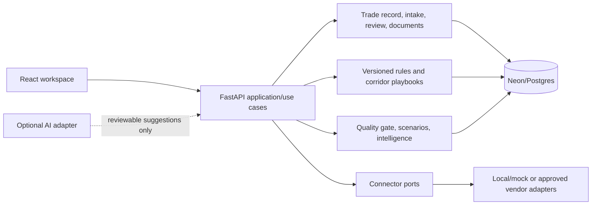

# FreightDoc world-class platform plan

## Decision and delivery shape

FreightDoc should evolve as a **modular monolith** in the existing FastAPI +
SQLAlchemy/Neon + React/Vite application. The shipment workspace is the system
of record; deterministic rules, templates, checks, and reviewed facts are the
primary product. AI is a replaceable assistive adapter, never an authority.

This is deliberately not a proposal to split services, buy data feeds, or
claim filing capability. Each phase is independently releasable, migrates
forward with Alembic, and preserves the current `/full-pipeline` demo route
and owner-scoped workspace.

### Non-negotiable product contract

- A deterministic path is available with no model key: native extraction,
  rules, templates, calculations, reference search, and human entry/review.
- AI output is stored as a `suggestion` with provider/model, prompt/template
  version, input artifact/fact IDs, timestamp, confidence, and rationale. It
  can create neither a legal/commercial fact nor a generated/final document
  revision without an explicit user action.
- Human edits create immutable revisions. Maker/checker approval records the
  actor, decision, timestamp, findings accepted/waived, and reason; it does
  not imply broker, customs, or legal approval.
- Original upload bytes remain transient. Store only permitted extracted facts,
  hashes, metadata, and rendered/reviewed artifacts under the existing privacy
  policy. Never put them in logs, PWA caches, prompts beyond the selected
  bounded text, or public links.
- Every screen and export keeps the existing informational-preparation and
  licensed-broker review disclaimer. `ready_to_ship` means internally
  review-ready, not cleared, filed, screened, or legally compliant.

### Capability disposition

| Disposition | Themes | Meaning |
|---|---|---|
| Implement now | 1-10, 14-15, 18-19 | Extend the current database-backed workspace using deterministic local logic and reviewable data. |
| Adapter scaffolding | 11-13, 16-17, 20 | Provide stable ports, contracts, mock/local adapters, and operator UI; no false live-data claim. |
| Vendor/regulatory blocked | official filing/clearance submission, authoritative sanctions screening, carrier status, SSO/SCIM, EDI certification | Activation requires licensed data, customer/vendor agreement, security review, and where applicable government/customs certification. |

### Complete capability matrix: baseline first, AI optional

In every row, the baseline must remain available when no model, provider,
network access, or AI key exists. AI requests run out-of-band from the core
workflow; an outage, timeout, refusal, low confidence, or malformed response
creates an optional suggestion/task and never blocks deterministic completion.
No AI response may create final legal/commercial facts, publish a rule, approve
a dossier, clear a screening hit, send external data, or file a declaration
without an authorized human confirmation recorded in the audit trail.

| # / capability | Required deterministic baseline (no AI) | Optional AI enhancement | User review, override, and safe failure | Paid/regulated authority dependency |
|---|---|---|---|---|
| 1 Canonical shipment/trade record | Versioned typed facts, source links, manual edit, and revision history. | Suggest normalized facts from selected evidence. | Per-field accept/reject; unavailable AI leaves editable facts and a task. | None. |
| 2 Evidence-first extraction | Native bounded parsers, page/offset provenance, manual transcription. | Suggest labels, field mappings, or conflict summaries. | Evidence remains visible; low/failed extraction requires human review. | OCR/data service only if later chosen; no requirement now. |
| 3 Review queues/maker-checker | Status transitions, assignment, separation-of-duties rule, decisions/reasons. | Prioritize queue or summarize findings. | Human alone makes/overrides decisions; AI failure changes no status. | None; enterprise workflow/identity may be contracted later. |
| 4 Versioned compliance/rules engine | Validated effective-dated DSL, deterministic evaluation, pinned result/version. | Propose clause wording/tests from cited source. | Authorized reviewer publishes; invalid/AI failure retains last published rule. | Official rule sources and legal review may be needed by jurisdiction. |
| 5 Corridor playbook/config studio | Versioned checklists, required docs, conditions, approval/publish workflow. | Draft a playbook/change explanation. | Reviewer diff/approves; fallback is current published playbook. | Source licensing/legal authority where content is regulated. |
| 6 Document workflow orchestrator | Ordered steps, dependencies, retries, manual completion and audit. | Suggest next action or summarize blocker. | Operator retries/skips with reason; AI failure never stops a manual path. | None. |
| 7 Pre-flight data quality gate | Rule-based completeness, consistency, freshness, and critical blockers. | Explain findings or suggest remediation. | User resolves/waives per policy with reason; AI failure preserves findings. | None; legal interpretation requires qualified reviewer. |
| 8 Unified intake/dedupe | SHA-256, normalized metadata matching, manual duplicate disposition. | Suggest near-duplicate grouping. | User chooses keep/replace/link; no automatic deletion; AI failure falls back to hashes. | None. |
| 9 Template/document generation studio | Approved templates filled only from approved facts; versioned PDF/rendering. | Draft optional text or map approved facts to template fields. | User reviews revision before finalization; failed AI leaves deterministic template/manual edit. | Jurisdiction-specific forms may require licensed/official templates. |
| 10 Immutable audit/compliance dossier export | Hash manifest, pinned versions, provenance, decisions, download/export. | Generate a non-authoritative review summary. | Export is produced deterministically; summary failure omitted; user selects final export. | Retention/e-signature requirements may apply by customer/jurisdiction. |
| 11 Integration gateway/connector SDK | Versioned ports, CSV/manual import/export, mock adapter, run log. | Map columns or explain adapter errors. | Human configures/enables execution; failure is visible/retryable with no invented status. | Vendor contracts/credentials, EDI certification, API licensing. |
| 12 Supplier/carrier collaboration portal | Scoped grants, expiring links, upload/comment/request workflow. | Draft requests or summarize shared evidence. | Sender reviews before sharing; revoke/expire access; AI failure does not affect access. | Partner agreement and possibly carrier API agreement. |
| 13 Sanctions/restricted-party screening | Manual case, source/evidence capture, mandatory "not screened" status when no source. | Explain/rank potential matches from supplied authoritative results. | Authorized human disposition only; failure/no data is never "clear". | Authoritative/paid lists, update SLA, matching policy, legal compliance ownership. |
| 14 HS copilot/rulings library | Local curated search, manual candidate choice, citations/versioned decision. | Rank candidates and explain differences. | Human selects/overrides; AI failure leaves search/manual entry; advisory label persists. | Official databases/rulings and broker/authority decision for final classification. |
| 15 Landed-cost/tariff simulator | Explicit formulas, saved assumptions, local/public snapshots, ranges/unknowns. | Explain sensitivity or suggest assumptions. | User edits/approves inputs; missing data yields unknown/range, never a fabricated amount. | Licensed tariff/FX/tax data or professional tax advice where required. |
| 16 Customs filing/clearance status adapters | Manual timeline, CSV/status evidence import, "not connected/not filed" states. | Summarize supplied messages/statuses. | Human records/validates status; AI failure preserves manual timeline and cannot submit. | Broker/customs authorization, certification, production credentials, liability approval. |
| 17 Enterprise identity/security/governance | Local roles, organization scoping, audit, retention/config policy controls. | Flag unusual access patterns from sanitized audit metadata. | Security admin investigates/overrides; failed AI creates no enforcement decision. | SSO/SCIM IdP agreement, enterprise plan, security review, key-management service. |
| 18 Reliability/resilience/SLOs | Health probes, idempotency, retries, outbox, circuit breakers, metrics. | Summarize incidents or cluster sanitized errors. | Operators control mitigation; AI failure never changes traffic/data/job state. | Paid observability/HA/backup services for production-grade guarantees. |
| 19 Operations intelligence | Deterministic aggregate KPIs, queue aging, rule/provider/run metrics. | Narrative insights/anomaly suggestions over authorized aggregates. | User verifies drill-down before action; unavailable AI retains dashboards. | BI warehouse/benchmark data may be paid; privacy governance required. |
| 20 Commercial ecosystem/implementation toolkit | Checklists, templates, configuration export, manual project tracking. | Draft implementation plans/mappings from approved inputs. | Owner reviews before sharing/activation; AI failure leaves templates/checklists. | Marketplace, partner contracts, implementation/legal services as applicable. |

## Target modules and boundaries

Keep `routers.py` thin: application services own workflow/authorization,
repositories own owner/organization-scoped persistence, and adapters own
vendor protocols. Domain/application code must not import Groq, HTTP clients,
or Clerk directly. Existing `Shipment`, `IntakeDocument`, `GeneratedPackage`,
`ValidationFinding`, and `AuditEvent` are the starting schema.

## Phased roadmap

### Phase 0 — foundation and safety envelope (ship first; 2-3 focused days)

**Covers:** cross-cutting controls for all themes; consolidates existing themes
1-3, 7, 10, and 18 before adding new workflow surface.

**Scope.** Introduce an organization-ready access boundary while preserving
single-owner behavior; define a canonical fact/revision ledger; make audit
events append-only at the application layer; standardize feature flags,
provenance, deterministic/AI mode, and error envelopes. Retain the current
shipment status model, then add explicit `draft -> intake -> needs_review ->
review_ready -> archived` transition guards rather than silently changing data.

**Migrations/data model.** Add `organizations`, `organization_memberships`
(initially one implicit personal organization per owner), `shipment_revisions`,
`trade_facts`, `fact_sources`, `review_tasks`, `review_decisions`, and
`workflow_runs`. Add `organization_id`, `canonical_revision_id`, and optimistic
`revision_number` to shipments; add SHA-256 and retention metadata to intake
documents; add `event_hash`, `previous_event_hash` to new audit events. Backfill
one revision from `Shipment.payload`; do not mutate historical packages.

**API/UI.** Versioned `/shipments/{id}/record`, `/facts`, `/revisions`,
`/review-tasks`, `/audit`; conflict responses for stale revisions. Add a Record
timeline and review queue to Shipment Desk, with source/confidence badges and
"accept suggestion" as a distinct action.

**Fallback/AI.** Deterministic fact creation is manual form entry plus native
extractor findings. Optional AI may propose normalized fields only; unavailable,
timed out, malformed, or low-confidence AI yields an actionable task, never a
pipeline failure or automatic overwrite.

**Security/rollout/rollback.** Enforce organization+owner predicates in every
repository query and audit read; redact fact values from generic logs; rate-limit
mutations. Gate the new UI/API behind `CANONICAL_RECORD_V1`; deploy migration
first, enable for internal accounts, then default on. Roll back the flag and
write only legacy shipment payloads; do not down-migrate/delete audit history.

**Acceptance/tests.** Existing 41 backend/19 frontend tests remain green;
add migration/backfill, cross-tenant 404, stale-write, audit-chain, provenance,
AI-off, and keyboard-accessible review-queue tests. A reviewer can reconstruct
the value, source, revision, and decision for every dossier field.

### Phase 1 — deterministic evidence and quality workflow (MVP implementation; 4-5 days)

**Covers:** 1 canonical record, 2 evidence-first extraction, 3 maker/checker,
6 document orchestration, 7 pre-flight gate, 8 unified intake/dedupe, 9
generation studio, 10 immutable dossier export.

**Scope.** Turn upload findings into evidence-linked canonical facts, dedupe
repeated documents, route missing/conflicting/high-risk facts into a review
queue, validate before generation, and produce a manifest-backed dossier ZIP.
Add a small deterministic template studio for the currently supported document
types; generated documents are revisions rather than mutable dictionaries.

**Migrations/data model.** Add `document_fingerprints` (hash, normalized
metadata, similarity key), `evidence_spans` (document/fact/page/offset),
`document_workflows`, `workflow_steps`, `quality_rules`, `quality_findings`,
`document_templates`, `template_versions`, `document_revisions`,
`dossier_exports`, and `dossier_manifest_entries`. Index by organization,
shipment, status, rule/template version, and fingerprint. Seed quality rules
from current Pydantic/rule-engine checks; seed versioned templates from current
PDF document layouts.

**API/UI.** Add idempotent `POST /shipments/{id}/intake`, duplicate-aware
upload response, `GET /quality`, `POST /quality/{finding}/resolve`,
`POST /review-tasks/{id}/decision`, `/templates`, and `POST /dossiers/{id}/export`.
The UI gets an intake inbox (duplicate/replace/keep), evidence side panel,
pre-flight checklist, document workflow board, template preview, and export
manifest/download screen.

**Fallback/AI.** Native PDF/DOCX/XLSX/text extraction and field matching are
the baseline. Dedupe uses SHA-256 then deterministic normalized keys. Quality
rules run locally. AI may label a document, suggest a field mapping, summarize
a conflict, or draft a document from approved facts; it must return structured
suggestions, cite evidence IDs, and be accepted per field/document revision.

**Constraints.** Template content must say "draft" until required approvals;
exports include hash, versions, provenance, review decisions, and disclaimer.
No OCR SaaS is required: unsupported scanned image-only documents become a
manual review task until a licensed/local OCR adapter is approved.

**Rollout/rollback.** Shadow-run quality checks for existing dossier creation,
display findings without blocking for one release, then block only configured
critical rules. A template version is immutable and can be deactivated; select
the prior version to roll back. Preserve prior export manifests/artifacts.

**Acceptance/tests.** Same binary re-upload is detected without storing bytes;
conflicting invoice facts block export until disposition; an approver cannot
approve their own maker task when maker-checker is enabled; ZIP manifest hashes
match included files; AI-disabled flow creates a complete reviewed dossier.

### Phase 2 — governed trade knowledge and decision support (next increment; 4-6 days)

**Covers:** 4 versioned rules engine, 5 corridor playbooks, 14 HS/rulings
library, 15 landed-cost/tariff simulator.

**Scope.** Move corridor JSON into a reviewable configuration studio with
effective dating and simulation. Add a curated local HS/rulings reference
library and deterministic landed-cost calculations. Continue to surface source
URLs and fallback status; do not represent local reference data as an official
tariff ruling.

**Migrations/data model.** Add `rule_sets`, `rule_versions`, `rule_clauses`,
`corridor_playbooks`, `playbook_versions`, `classification_candidates`,
`classification_decisions`, `rulings`, `ruling_sources`, `tariff_snapshots`,
`scenario_runs`, `scenario_inputs`, and `scenario_results`. Store rules as a
validated JSON DSL with schema/version/checksum, not executable code. Cache
tariff snapshots with retrieval time, source, jurisdiction, and expiry.

**API/UI.** `/rules` and `/playbooks` CRUD with draft/submit/approve/publish;
`POST /shipments/{id}/classifications/candidates`, `/rulings/search`, and
`POST /scenarios/landed-cost`. Add a config studio with diff/effective date,
classification comparison + source cards, and a scenario table showing duty,
tax, freight, insurance, fees, currency assumptions, exclusions, and range.

**Fallback/AI.** Deterministic rules evaluate from approved facts and pinned
versions. Classification fallback searches locally curated HS/ruling entries by
tokens and lets the user choose; scenarios use explicit formulas and saved
assumptions. AI may rank/explain candidates or propose a playbook change, but
cannot publish rules, choose HS, or alter calculation inputs/results.

**Authority constraints.** Only cite official/public sources when licensed and
captured. Classification/rulings remain advisory; final classification requires
the importer/broker/competent authority. FX/tax/tariff results must label source
time and may be stale. No claim of coverage outside seeded corridors.

**Rollout/rollback.** Import current `country_rules.json` as a read-only first
version; compare legacy and new engine output in CI and production shadow mode.
Pin each dossier to its version. Rollback is routing new runs to the prior
published version, not rewriting prior decisions.

**Acceptance/tests.** Rule version output is reproducible from pinned facts;
unauthorized users cannot publish; a changed assumption alters a traceable
scenario line item; missing/stale tariff data produces a range/unknown finding
rather than a fabricated duty rate.

### Phase 3 — operational resilience and intelligence (parallelizable after Phase 1; 3-4 days)

**Covers:** 18 reliability/resilience/SLOs and 19 operations intelligence.

**Scope.** Make long-running intake/generation/export work durable and
observable; expose aggregate operational health without leaking trade data.
Use a database-backed job/outbox pattern before introducing a queue service.

**Migrations/data model.** Add `jobs`, `job_attempts`, `outbox_events`,
`idempotency_keys`, `service_level_indicators`, `operational_metrics_daily`,
and `incident_annotations`. Jobs have bounded retry/backoff, dead-letter
state, correlation ID, and sanitized failure code; events are idempotent.

**API/UI.** `GET /operations/health`, `/operations/metrics`, job retry for
authorized operators, and per-shipment run history. UI adds an operations panel
for processing latency, extraction success, review aging, critical-finding
rate, rule coverage, provider availability, and backlog—not sensitive document
contents.

**Fallback/AI.** No AI is needed. If an optional AI provider fails, continue
deterministic stages, mark the suggestion unavailable, and retry only that job
when selected. Circuit-break external adapters; cache only permitted public
reference snapshots.

**Security/rollout/rollback.** Separate operational role, minimize metrics
labels, and never emit raw documents/party names. Start with structured logs,
health/readiness probes, and Postgres outbox on free tiers; define demo SLOs
(for example 99% successful deterministic workflow runs excluding invalid
input) rather than claiming production availability. Enable async jobs behind
a flag; rollback to the existing synchronous path for eligible operations.

**Acceptance/tests.** Duplicate idempotency key runs once; worker crash does
not lose a job; retry preserves correlation/provenance; dashboard aggregates
are organization-scoped; simulated provider timeout opens circuit and permits
manual deterministic completion.

### Phase 4 — integration and enterprise foundations (scaffold only; 3-5 days)

**Covers:** 11 connector gateway/SDK, 12 collaboration portal, 13 restricted
party screening, 16 customs/clearance status, 17 enterprise governance, 20
commercial ecosystem/implementation toolkit.

**Scope.** Define external ports and credentials/secrets ownership; ship a
local/mock connector plus CSV/API import/export, partner invite links with
least privilege, and implementation checklists. This phase does **not** turn on
real customs, sanctions, carrier, EDI, SSO, or SCIM integrations.

**Migrations/data model.** Add `connectors`, `connector_configs` (secret
reference only), `connector_runs`, `external_references`, `webhook_deliveries`,
`partner_access_grants`, `screening_cases`, `screening_hits`, `clearance_cases`,
`governance_policies`, `role_assignments`, `implementation_projects`, and
`implementation_tasks`. Encrypt vendor configuration only when a managed key
system exists; locally use environment references and mock config, never DB
secrets.

**API/UI.** Versioned `/connectors` capability manifest and run history;
`/partners` invite/revoke scoped access; `/screening/cases` manual evidence
capture; `/clearance/cases` manual status timeline; `/governance/roles`;
`/implementation` checklist/export. Add connector status cards that say
"mock", "not configured", or "requires approved vendor" rather than "live".

**Fallback/AI.** CSV/manual status import and collaborator-uploaded evidence
are baseline. Screening fallback is **no screening performed** plus a required
manual task—not a local name similarity result presented as sanctions
clearance. AI may summarize a connector error, map CSV columns, or explain a
possible hit only after authoritative data is supplied; it cannot clear a hit,
submit a filing, or contact a counterparty.

**Authority/licensing blockers.**

| Capability | Blocker before activation |
|---|---|
| Restricted-party screening | Authoritative licensed/official list, update SLA, matching policy, legal/compliance owner, adverse-match workflow. |
| Customs filing/clearance | Customs authority/broker authorization, jurisdiction certification, signed data interchange, production credentials and liability review. |
| Carrier tracking/EDI | Carrier/EDI trading-partner agreement, credentials, schema certification and monitoring. |
| SSO/SCIM | Customer identity-provider agreement, enterprise plan/security review, tenant/domain verification and provisioning audit controls. |

**Security/rollout/rollback.** Connector scopes are per organization and
capability; outbound webhook signatures, replay protection, schema validation,
timeouts, and audit records are mandatory. Partner grants expire and exclude
unapproved exports. Feature flags default all production adapters off. Revoke a
connector/grant and retain only audit metadata on rollback; vendor-side actions
need their own compensating procedure.

**Acceptance/tests.** Mock connector contract tests run against SDK fixtures;
secret values cannot be returned/logged; partner cannot enumerate unrelated
shipments; a screening case cannot become "cleared" without an authorized human
decision and authoritative-source reference; all blocked adapters visibly
state their prerequisite.

## Initial approval backlog (hackathon-sized)

This is the practical first slice, not a speculative multi-year rewrite. Keep
all other Phase 2-4 work as planned backlog until it proves necessary.

1. Add canonical shipment revisions, facts, fact sources, review tasks, and
   organization-compatible owner scoping; backfill existing shipments.
2. Add provenance/confidence to native extraction findings and explicit
   accept/reject endpoints with audit events.
3. Add pre-flight deterministic quality rules for required facts, cross-document
   conflicts, low confidence, unsupported corridor, stale/fallback tariff, and
   critical validation findings.
4. Add SHA-256 duplicate detection and review disposition without storing input
   bytes.
5. Add maker/checker guard with a feature flag; default to a single human
   review decision for personal workspaces.
6. Add immutable document revisions and a dossier manifest ZIP with hashes,
   source/version references, findings, decisions, and disclaimer.
7. Add the React Record timeline, Intake/Quality/Review tabs, and clear
   AI-unavailable/manual-review states.
8. Add deterministic AI-off and authorization/migration/export contract tests;
   preserve the existing test baselines.
9. Add the rules/playbook schema and import current `country_rules.json` as a
   single read-only version; defer the editing UI to the next slice.
10. Add connector interfaces plus a mock/CSV adapter and disabled integration
   status page—no vendor calls or compliance claims.

**Definition of done for the initial slice:** a user can create a shipment,
ingest an allowed document, inspect/review evidence-derived facts, resolve
deterministic blockers, generate a versioned package with AI absent, approve it
under the configured workflow, and download a hash-manifested dossier. Another
organization cannot read or act on any of it.

## Engineering controls and decision records

Before each phase, add a concise ADR using the repository convention:

- ADR: modular-monolith bounded modules and dependency direction.
- ADR: canonical facts/revisions versus mutable shipment JSON.
- ADR: evidence retention, export immutability, and deletion policy.
- ADR: rules DSL/effective-dated publication and pinned execution.
- ADR: optional-AI suggestion contract and provider outage behavior.
- ADR: connector port, authority boundary, and vendor activation checklist.
- ADR: job/outbox reliability model and free-tier operational limits.

Run Alembic upgrade and downgrade checks on a disposable database, backend
pytest, frontend Vitest/build, API contract tests, migration/backfill fixture
tests, and manual accessibility/security smoke tests for every phase. Add a
release checklist confirming migration backup, flag state, dashboards, rollback
owner, and authority claims. Free Render/Vercel/Neon remain suitable for a demo
and internal pilot only; production SLOs, key management, backups, retention,
and regulated data vendors require a funded operational decision.
