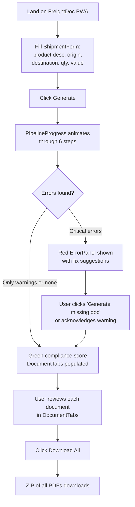

# FreightDoc — app_flow.md

## 1. Primary User Journey



## 2. Screen Flow

| Screen | Purpose | Key Components |
|---|---|---|
| Landing / Form | Capture shipment inputs | ShipmentForm |
| Pipeline Progress | Live feedback during the ~15-20s pipeline run | PipelineProgress (step-by-step animated status) |
| Results | Show generated documents, errors, compliance score | DocumentTabs, ErrorPanel, WarningPanel, DownloadBar |
| Country Pairs (secondary) | Show which 8 corridors are supported | Static list, informational only |

## 3. Error / Edge-Case Flows

```mermaid
flowchart TD
    E1[External API (USITC/Comtrade/TARIC) fails] --> E2[Fallback to cached\nhardcoded tariff data]
    E2 --> E3[Pipeline continues normally]
    E4[Cross-validator flags critical error] --> E5[Download blocked until\nuser acknowledges or fixes]
    E6[Cross-validator flags warning only] --> E7[Download allowed with\nvisible warning banner]
```

## 4. User Journey Documentation Requirements (Mandatory for Stage 2)

The coding agent must produce, referencing the flows above:
- `docs/system_overview.md` must include a plain-English narrative walk
  through the primary user journey (Section 1) suitable for a
  non-technical stakeholder.
- `docs/codebase_explained.md` must map each screen/component in Section
  2 to its exact file path in the frontend structure.
- `docs/troubleshooting_guide.md` must document the error/edge-case flows
  in Section 3, including what a developer should check first if the
  fallback path is unexpectedly triggered in production.

## 5. Screen Flow Documentation Requirements
- Every component listed in Section 2's table must have a corresponding
  entry in `docs/lld.md` describing its props, state, and the API
  endpoint(s) it calls.
- `.private_docs/code_walkthrough.md` must walk through the exact
  React component tree and data flow for the Results screen, since it is
  the most visually and logically complex screen in the app.
