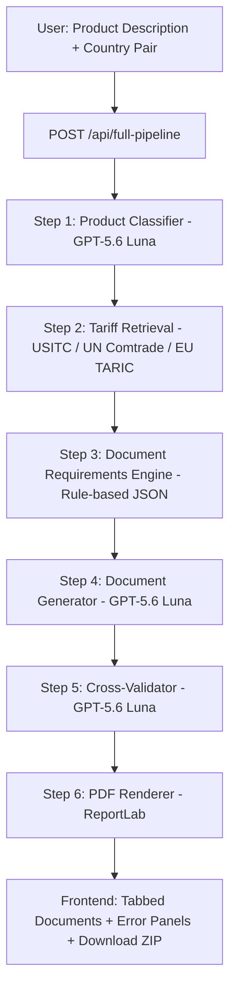
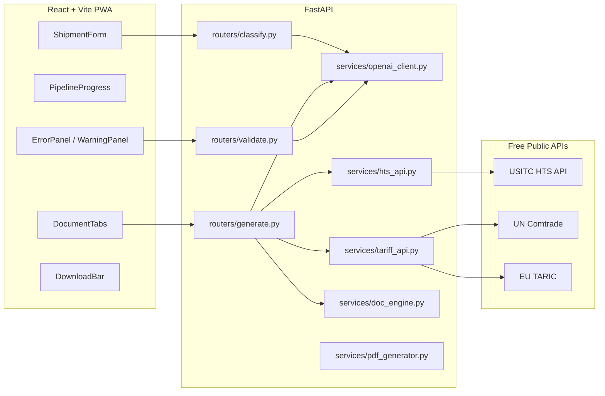
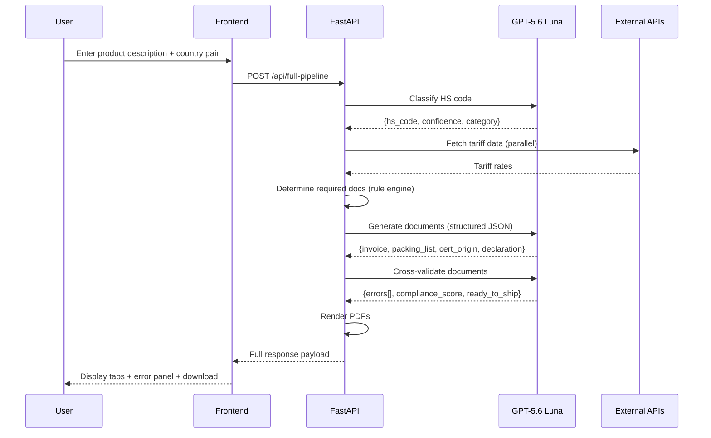

# FreightDoc — architecture.md

## 1. System Architecture Overview

## 2. Component Diagram

## 3. Sequence Diagram — Full Pipeline

## 4. Documentation Structure Requirements (Mandatory for Stage 2)

The coding agent must produce the following, each cross-referenced from
this architecture.md:

- `docs/hld.md` — High-level design: the diagrams above, expanded with
  deployment topology (Railway + Vercel), and the rationale for the
  stateless MVP architecture.
- `docs/lld.md` — Low-level design: function signatures, Pydantic models,
  exact request/response schemas for every endpoint.
- `docs/uml_diagrams.md` — Additional UML (component, deployment) beyond
  what's in this file, in Mermaid syntax.
- `docs/class_diagrams.md` — Class diagrams for all Pydantic models
  (`ShipmentRequest`, `ClassificationResult`, `DocumentPackage`,
  `ValidationResult`, etc.) in Mermaid `classDiagram` syntax.
- `docs/entity_relationships.md` — Even though the MVP has no database,
  this must document the conceptual entity relationships (Shipment →
  Documents → ValidationErrors) as they would map to a future schema.
- `docs/system_overview.md` — Plain-English walkthrough of the 6-step
  pipeline for a new engineer, linking to this architecture.md for
  diagrams.
- `docs/design_decisions.md` — Why a rule engine for document
  requirements instead of asking the LLM to "remember" the rules (answer:
  determinism and auditability for a domain with legal/financial
  consequences). Why 3 LLM calls instead of 1 mega-prompt (answer:
  separation of concerns, better error isolation, cheaper retries on
  failure).

## 5. HLD Requirements
Must cover: deployment topology, the stateless-per-request design
rationale, external API dependency map, and the explicit boundary between
deterministic logic and LLM reasoning (see Section 2 of PRD.md — "where AI
is and isn't used" is a first-class architectural decision, not an
implementation detail, and must be documented as such).

## 6. LLD Requirements
Must cover: every Pydantic model field with type and validation rule,
every service function signature, the exact JSON schema expected from
each GPT-5.6 Luna call (matching the prompts in this repo's spec docs),
and the PDF rendering layout for each document type.

## 7. UML Requirements
Minimum required diagrams in `docs/uml_diagrams.md` and
`docs/class_diagrams.md`:
- Component diagram (expanded from Section 2 above)
- Sequence diagram (expanded from Section 3 above) covering the error/
  fallback path (external API failure → cached fallback → continue
  pipeline)
- Class diagram for all Pydantic models
- Deployment diagram (Railway backend, Vercel frontend, external API
  boundaries)

## 8. Architecture Documentation Requirements
- Every architectural decision (rule engine vs. LLM, stateless vs.
  stateful, single mega-prompt vs. multi-step pipeline, sync vs. async
  external calls) must have a corresponding entry in
  `.private_docs/architecture_rationale.md` explaining the decision, the
  alternatives considered, and why the alternatives were rejected.
- `docs/known_tradeoffs.md` must list every tradeoff made for hackathon
  speed (e.g., no persistence, no auth, 8 corridors only) with a note on
  what would change in a production version.
