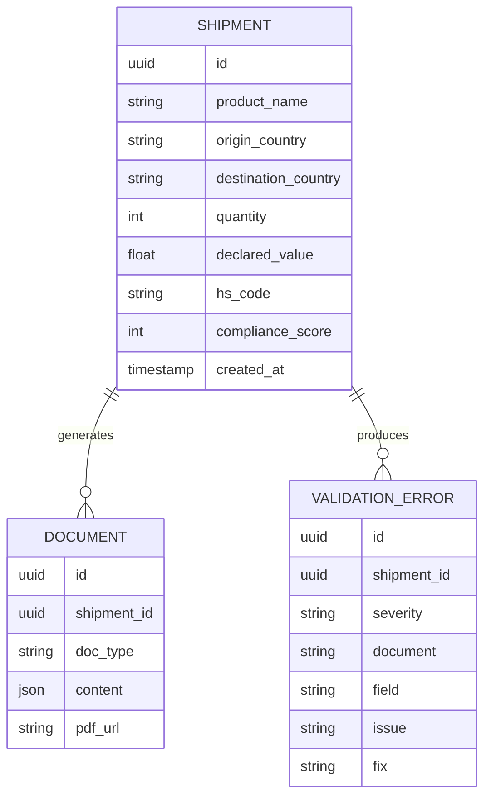

# FreightDoc — backend_schema.md

## 1. MVP Data Model (Stateless — No Database)
The hackathon MVP persists nothing between requests. All data models below
are **Pydantic request/response models**, not database tables.

```python
class ShipmentRequest(BaseModel):
    product_name: str
    product_description: str
    origin_country: str       # ISO 3166-1 alpha-2
    destination_country: str  # ISO 3166-1 alpha-2
    quantity: int
    declared_value: float
    currency: str = "USD"
    exporter_name: str | None = None
    importer_name: str | None = None

class ClassificationResult(BaseModel):
    hs_code: str
    hs_description: str
    confidence: float
    category: str  # electronics|textiles|food|chemicals|machinery|other
    notes: str

class TariffData(BaseModel):
    duty_rate: float
    source: str  # "USITC" | "UN Comtrade" | "EU TARIC"
    additional_flags: list[str]

class DocumentPackage(BaseModel):
    commercial_invoice: dict
    packing_list: dict
    certificate_of_origin: dict
    customs_declaration: dict
    ce_declaration: dict | None = None

class ValidationError(BaseModel):
    severity: Literal["critical", "warning"]
    document: str
    field: str
    issue: str
    fix: str

class ValidationResult(BaseModel):
    errors: list[ValidationError]
    compliance_score: int
    ready_to_ship: bool
```

## 2. Conceptual Entity Relationships (Future Schema, Deferred)


This is explicitly **not implemented** in the hackathon MVP. It is
documented here so the coding agent's Stage 2 database rationale doc has a
concrete target schema to reference when persistence is added
post-hackathon.

## 3. Country Rules Config (JSON, not a database table)
```json
{
  "US-DE": {
    "required_docs": ["commercial_invoice", "packing_list",
      "certificate_of_origin", "customs_declaration"],
    "conditional": {"electronics": ["ce_declaration"]}
  }
}
```
This file (`data/country_rules.json`) IS the persistence layer for the
document-requirements rule engine — it is version-controlled config, not a
database, and should be documented as such.

## 4. Schema Documentation Requirements (Mandatory for Stage 2)
- `docs/database_design.md` must explicitly state: "FreightDoc's MVP has
  no database; this document describes (a) why, and (b) the target schema
  for when shipment history/persistence is added," and then reproduce and
  expand the ERD in Section 2.
- `.private_docs/database_rationale.md` must justify statelessness as a
  deliberate hackathon-scope decision, not an oversight, and describe the
  migration path (introduce Postgres, migrate `country_rules.json` logic
  unchanged, add `Shipment`/`Document`/`ValidationError` tables per the
  ERD above).

## 5. Entity Relationship Documentation Requirements
- `docs/entity_relationships.md` must expand the Mermaid ERD above with
  cardinality explanations in plain English and note which relationships
  would need indexes once implemented (`shipment_id` foreign keys on both
  `DOCUMENT` and `VALIDATION_ERROR`).

## 6. Database Explanation Requirements
- Even in the schema-less MVP, `docs/database_design.md` must address
  every item in the production-readiness database checklist (connection
  pooling, indexing, migrations, backups, etc.) with the explicit answer
  "N/A in MVP — see rationale" for each, rather than omitting them.
